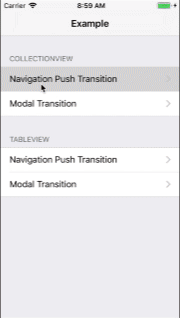
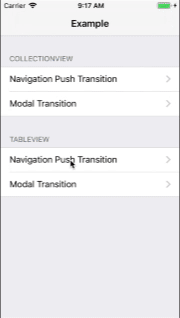

RMPZoomTransitionAnimator-Swift
==


[](LICENSE)
[](https://developer.apple.com/swift)
[](http://cocoadocs.org/docsets/RMPZoomTransitionAnimator-Swift)
[](https://github.com/hsylife/SwiftyPickerPopover)

`RMPZoomTransitionAnimator-Swift` provide a custom transition zooming animation.

Not only `UICollectionView`, this is possible to use any other `UIViewController` transition.

This transition animation is like the "Pinterest" animation, but this is very simple and small library.




## Installation

### CocoaPods

Simply add the following line to your `Podfile`:

```
pod 'RMPZoomTransitionAnimator-Swift'
```

### Cartage

Simply add the following line to your `Cartfile`:

```
github "yhirano/RMPZoomTransitionAnimator-Swift"
```

## Usage

Setup is as below:

### Use for an UINavigationController push transition

Refer to the example project for details.

- Import `RMPZoomTransitionAnimator-Swift`
- Adopt `RMPZoomTransitionAnimating`
- Implement the `RMPZoomTransitionAnimating` protocol below, both source view controller and destination view controller
  1. `var transitionSourceImageView: UIImageView { get }`
  2. `var transitionSourceBackgroundColor: UIColor? { get }`
  3. `var transitionDestinationImageViewFrame: CGRect { get }`
- Returns RMPZoomTransitionAnimator instance in the UINavigationController delegate method

```swift
// UINavigationControllerDelegate
func navigationController(_ navigationController: UINavigationController,
                          animationControllerFor operation: UINavigationController.Operation,
                          from fromVC: UIViewController,
                          to toVC: UIViewController) -> UIViewControllerAnimatedTransitioning? {
    guard let sourceTransition = fromVC as? RMPZoomTransitionAnimating,
          let destinationTransition = toVC as? RMPZoomTransitionable else {
            return nil
    }

    // minimum implementation for example
    let animator = RMPZoomTransitionAnimator()
    animator.goingForward = (operation == .push)
    animator.sourceTransition = sourceTransition
    animator.destinationTransition = destinationTransition
    return animator;
}
```

### Use for a modal transition

Refer to the example project for details.

- Import `RMPZoomTransitionAnimator-Swift`
- Adopt `RMPZoomTransitionAnimating`
- Implement `RMPZoomTransitionAnimating` protocol below, both source view controller and destination view controller
  1. `var transitionSourceImageView: UIImageView { get }`
  2. `var transitionSourceBackgroundColor: UIColor? { get }`
  3. `var transitionDestinationImageViewFrame: CGRect { get }`
- Set the transitioningDelegate in `prepare(for segue: UIStoryboardSegue, sender: Any?)`
- Returns RMPZoomTransitionAnimator instance in the UIViewControllerTransitioningDelegate method

```swift
// UIViewControllerTransitioningDelegate
func animationController(forPresented presented: UIViewController,
                         presenting: UIViewController,
                         source: UIViewController) -> UIViewControllerAnimatedTransitioning? {
    guard let sourceTransition = source as? RMPZoomTransitionAnimating,
          let destinationTransition = presented as? RMPZoomTransitionable else {
            return nil
    }

    let animator = RMPZoomTransitionAnimator()
    animator.goingForward = true
    animator.sourceTransition = sourceTransition
    animator.destinationTransition = destinationTransition
    return animator;
}

func animationController(forDismissed dismissed: UIViewController) -> UIViewControllerAnimatedTransitioning? {
    guard let sourceTransition = dismissed as? RMPZoomTransitionable else {
            return nil
    }
    let destinationTransition = self

    // minimum implementation for example
    let animator = RMPZoomTransitionAnimator()
    animator.goingForward = false
    animator.sourceTransition = sourceTransition
    animator.destinationTransition = destinationTransition
    return animator;
}
```

## Requirements

- iOS 10.0 or higher

## License

RMPZoomTransitionAnimator-Swift is available under the MIT license.

## References

[RMPZoomTransitionAnimator](https://github.com/recruit-mp/RMPZoomTransitionAnimator)
